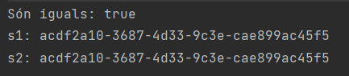
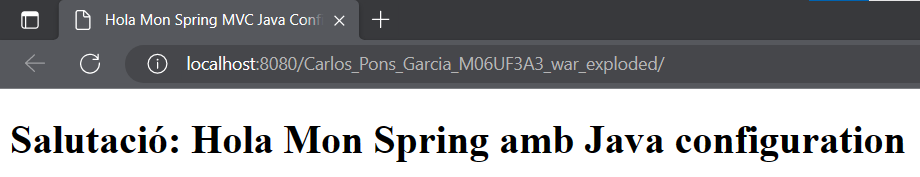
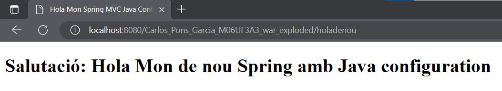

Part 1:

Què penseu que fa “synchronized (mutex)”?

La línia de codi "synchronized (mutex)" crea un bloc de codi sincronitzat que garanteix que només un fil d'execució pot accedir a aquest bloc al mateix temps. Això és important en aquest context per garantir que només es crei una instància de la classe Singleton en tot el programa.

El paràmetre "mutex" és un objecte que s'utilitza com a monitor per controlar l'accés al bloc sincronitzat.

Comprovació que els uuid de s1 i s2 són iguals:

Amb les vostres pròpies paraules, què penseu què està passant i com funciona aquest patró? Per a què ens podria ser d’utilitat?

El patró Singleton s'utilitza per assegurar que només hi hagi una instància d'una classe i per proporcionar un punt d'accés global a aquesta instància. Això es fa creant la instància única en un mètode estàtic "getInstance()", que es crida per obtenir la referència a la instància única. Per garantir que només es creï una instància en un entorn de múltiples fils, la instància es crea de manera segura en un bloc sincronitzat. El patró Singleton és útil per assegurar que només hi hagi una instància d'una classe en tot el programa, com ara una connexió única a una base de dades o per coordinar processos i compartir dades.

Part 2:

Comprovació de l'execució del servlet/sprinng amb tomcat
Resultat hola món:

Resultat hola de nou:

